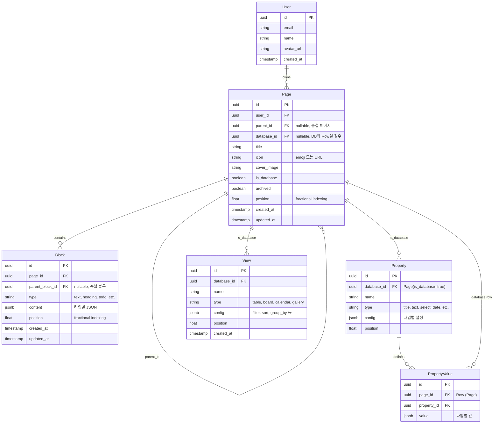

# 데이터 모델

## ERD (Entity Relationship Diagram)



---

## 엔티티 상세

### User

```typescript
interface User {
  id: string
  email: string
  name: string
  avatar_url?: string
  created_at: string
}
```

### Page

페이지는 **일반 페이지**와 **데이터베이스**를 모두 표현합니다.
데이터베이스의 Row도 Page로 표현됩니다 (database_id 참조).

```typescript
interface Page {
  id: string
  user_id: string
  parent_id: string | null     // 중첩 페이지
  database_id: string | null   // DB의 Row일 경우
  title: string
  icon?: string                // emoji 또는 URL
  cover_image?: string
  is_database: boolean
  archived: boolean
  position: number             // fractional indexing
  created_at: string
  updated_at: string
}

// DTO
interface CreatePageDto {
  parent_id?: string
  database_id?: string
  title?: string
  icon?: string
  is_database?: boolean
}

interface UpdatePageDto {
  title?: string
  icon?: string
  cover_image?: string
  archived?: boolean
  position?: number
}
```

### Block

```typescript
type BlockType =
  | 'text'
  | 'heading_1' | 'heading_2' | 'heading_3'
  | 'bulleted_list' | 'numbered_list' | 'todo'
  | 'toggle' | 'quote' | 'divider' | 'callout'
  | 'code' | 'image' | 'file' | 'bookmark'
  | 'table' | 'column_list' | 'column'
  | 'database_inline' | 'database_reference'

interface Block {
  id: string
  page_id: string
  parent_block_id: string | null  // 중첩 블록 (toggle 내부 등)
  type: BlockType
  content: BlockContent
  position: number
  created_at: string
  updated_at: string
}

// 블록 타입별 content
type BlockContent =
  | TextBlockContent
  | HeadingBlockContent
  | TodoBlockContent
  | CodeBlockContent
  | ImageBlockContent
  | DatabaseReferenceBlockContent

interface TextBlockContent {
  type: 'text'
  richText: RichTextSegment[]
}

interface HeadingBlockContent {
  type: 'heading_1' | 'heading_2' | 'heading_3'
  richText: RichTextSegment[]
}

interface TodoBlockContent {
  type: 'todo'
  richText: RichTextSegment[]
  checked: boolean
}

interface CodeBlockContent {
  type: 'code'
  language: string
  code: string
}

interface ImageBlockContent {
  type: 'image'
  url: string
  caption?: string
}

interface DatabaseReferenceBlockContent {
  type: 'database_reference'
  database_id: string
}

// Rich Text
interface RichTextSegment {
  text: string
  annotations?: RichTextAnnotations
  link?: string
}

interface RichTextAnnotations {
  bold?: boolean
  italic?: boolean
  underline?: boolean
  strikethrough?: boolean
  code?: boolean
  color?: string
}
```

### Property (Database 속성)

```typescript
type PropertyType =
  | 'title'       // 필수, 각 DB에 하나
  | 'text'
  | 'number'
  | 'select'
  | 'multi_select'
  | 'date'
  | 'person'
  | 'checkbox'
  | 'url'
  | 'email'
  | 'phone'
  | 'formula'
  | 'relation'
  | 'rollup'
  | 'files'
  | 'created_time'
  | 'created_by'
  | 'last_edited_time'
  | 'last_edited_by'

interface Property {
  id: string
  database_id: string
  name: string
  type: PropertyType
  config: PropertyConfig
  position: number
}

// 속성 타입별 config
type PropertyConfig =
  | SelectPropertyConfig
  | NumberPropertyConfig
  | FormulaPropertyConfig
  | RelationPropertyConfig
  | DefaultPropertyConfig

interface SelectPropertyConfig {
  options: SelectOption[]
}

interface SelectOption {
  id: string
  name: string
  color: string
}

interface NumberPropertyConfig {
  format: 'number' | 'percent' | 'dollar' | 'euro' | 'won'
}

interface FormulaPropertyConfig {
  expression: string
}

interface RelationPropertyConfig {
  database_id: string
  synced_property_id?: string
}

interface DefaultPropertyConfig {
  [key: string]: unknown
}
```

### PropertyValue

```typescript
interface PropertyValue {
  id: string
  page_id: string       // Row (Page)
  property_id: string
  value: PropertyValueData
}

// 속성 타입별 value
type PropertyValueData =
  | string                        // title, text, url, email, phone
  | number                        // number
  | boolean                       // checkbox
  | string                        // select (option_id)
  | string[]                      // multi_select (option_id[])
  | DateValue                     // date
  | string[]                      // person (user_id[])
  | string[]                      // relation (page_id[])
  | FileValue[]                   // files
  | null

interface DateValue {
  start: string          // ISO date
  end?: string           // ISO date (range)
  include_time?: boolean
}

interface FileValue {
  name: string
  url: string
  type: 'file' | 'external'
}
```

### View

```typescript
type ViewType = 'table' | 'board' | 'calendar' | 'gallery' | 'list' | 'timeline'

interface View {
  id: string
  database_id: string
  name: string
  type: ViewType
  config: ViewConfig
  position: number
  created_at: string
}

interface ViewConfig {
  // 공통
  filter?: FilterGroup
  sort?: SortCondition[]

  // 테이블
  visible_properties?: string[]  // property_id[]
  column_widths?: Record<string, number>

  // 보드
  group_by?: string              // property_id (select 타입)
  hide_empty_groups?: boolean

  // 캘린더
  date_property?: string         // property_id (date 타입)

  // 갤러리
  card_preview?: 'cover' | 'content' | 'page_content'
  card_preview_size?: 'small' | 'medium' | 'large'
}

// 필터
interface FilterGroup {
  operator: 'and' | 'or'
  conditions: (FilterCondition | FilterGroup)[]
}

interface FilterCondition {
  property_id: string
  operator: FilterOperator
  value: unknown
}

type FilterOperator =
  | 'equals' | 'not_equals'
  | 'contains' | 'not_contains'
  | 'starts_with' | 'ends_with'
  | 'is_empty' | 'is_not_empty'
  | 'greater_than' | 'less_than'
  | 'greater_than_or_equal' | 'less_than_or_equal'
  | 'is_within'  // date

// 정렬
interface SortCondition {
  property_id: string
  direction: 'asc' | 'desc'
}
```

---

## Fractional Indexing

위치(position)는 **Fractional Indexing** 방식을 사용합니다.

**장점:**
- 아이템 이동 시 다른 아이템 position 업데이트 불필요
- 동시 편집 충돌 최소화

**예시:**
```
A: 0.0
B: 0.5  ← A와 C 사이에 삽입: (0.0 + 1.0) / 2
C: 1.0
D: 0.75 ← B와 C 사이에 삽입: (0.5 + 1.0) / 2
```

**라이브러리:** `fractional-indexing` 또는 직접 구현

```typescript
import { generateKeyBetween } from 'fractional-indexing'

// A와 B 사이에 새 아이템 삽입
const newPosition = generateKeyBetween(itemA.position, itemB.position)
```

---

## Supabase 스키마

```sql
-- users (Supabase Auth 확장)
-- auth.users 테이블 사용, 추가 정보는 profiles 테이블

create table profiles (
  id uuid primary key references auth.users(id) on delete cascade,
  name text,
  avatar_url text,
  created_at timestamptz default now()
);

-- pages
create table pages (
  id uuid primary key default gen_random_uuid(),
  user_id uuid references auth.users(id) on delete cascade not null,
  parent_id uuid references pages(id) on delete cascade,
  database_id uuid references pages(id) on delete cascade,
  title text not null default '',
  icon text,
  cover_image text,
  is_database boolean default false,
  archived boolean default false,
  position text not null default '0',  -- fractional indexing (text)
  created_at timestamptz default now(),
  updated_at timestamptz default now()
);

-- blocks
create table blocks (
  id uuid primary key default gen_random_uuid(),
  page_id uuid references pages(id) on delete cascade not null,
  parent_block_id uuid references blocks(id) on delete cascade,
  type text not null,
  content jsonb not null default '{}',
  position text not null default '0',
  created_at timestamptz default now(),
  updated_at timestamptz default now()
);

-- properties
create table properties (
  id uuid primary key default gen_random_uuid(),
  database_id uuid references pages(id) on delete cascade not null,
  name text not null,
  type text not null,
  config jsonb default '{}',
  position text not null default '0'
);

-- property_values
create table property_values (
  id uuid primary key default gen_random_uuid(),
  page_id uuid references pages(id) on delete cascade not null,
  property_id uuid references properties(id) on delete cascade not null,
  value jsonb,
  unique(page_id, property_id)
);

-- views
create table views (
  id uuid primary key default gen_random_uuid(),
  database_id uuid references pages(id) on delete cascade not null,
  name text not null,
  type text not null,
  config jsonb default '{}',
  position text not null default '0',
  created_at timestamptz default now()
);

-- 인덱스
create index pages_user_id_idx on pages(user_id);
create index pages_parent_id_idx on pages(parent_id);
create index pages_database_id_idx on pages(database_id);
create index blocks_page_id_idx on blocks(page_id);
create index properties_database_id_idx on properties(database_id);
create index property_values_page_id_idx on property_values(page_id);
create index views_database_id_idx on views(database_id);

-- RLS 정책
alter table pages enable row level security;
alter table blocks enable row level security;
alter table properties enable row level security;
alter table property_values enable row level security;
alter table views enable row level security;

-- 예시 정책 (개인 소유)
create policy "Users can manage own pages"
  on pages for all
  using (user_id = auth.uid());

create policy "Users can manage blocks in own pages"
  on blocks for all
  using (
    page_id in (
      select id from pages where user_id = auth.uid()
    )
  );
```
