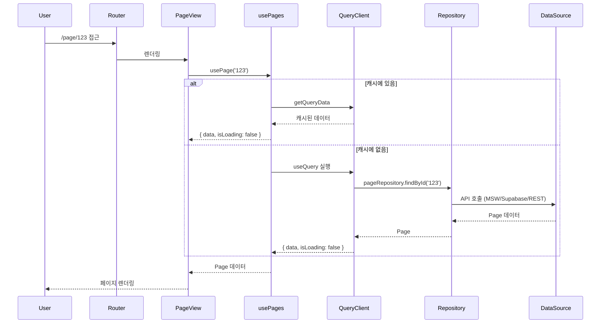
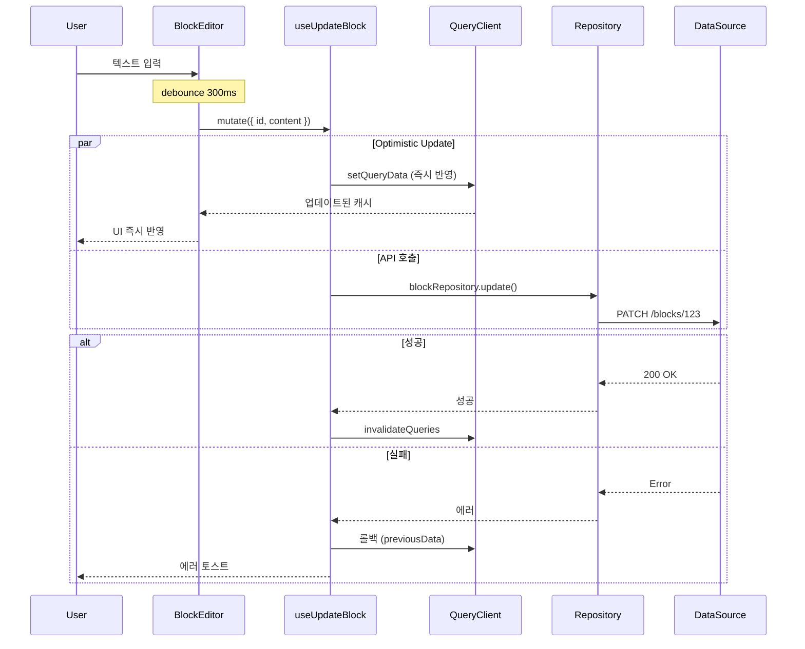
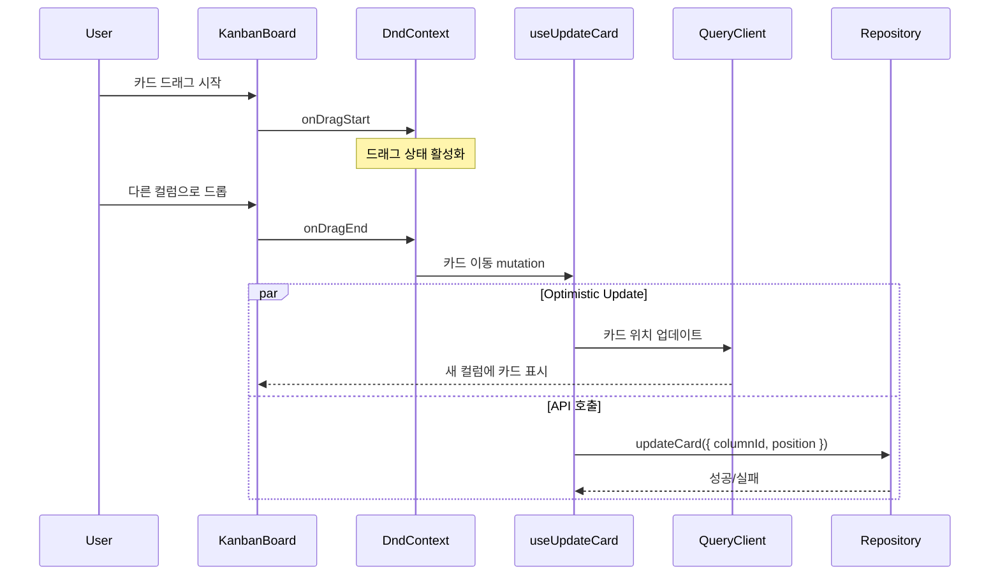

# 상태 관리 흐름

## 상태 분류 원칙

```
┌─────────────────────────────────────────────────────────────────┐
│                        상태 분류 매트릭스                         │
├─────────────────────────────────────────────────────────────────┤
│                                                                 │
│               서버에서 왔는가?                                    │
│                    │                                            │
│         ┌─────────┴─────────┐                                   │
│         │                   │                                   │
│        Yes                  No                                  │
│         │                   │                                   │
│         ▼                   ▼                                   │
│  ┌─────────────┐    ┌─────────────┐                            │
│  │ TanStack    │    │  어디서     │                            │
│  │   Query     │    │  공유되나?  │                            │
│  └─────────────┘    └──────┬──────┘                            │
│                            │                                    │
│               ┌────────────┼────────────┐                      │
│               │            │            │                      │
│            전역 공유    Feature 내    컴포넌트 내               │
│               │            │            │                      │
│               ▼            ▼            ▼                      │
│        ┌──────────┐  ┌──────────┐  ┌──────────┐               │
│        │ Zustand  │  │ Zustand  │  │ useState │               │
│        │ (전역)   │  │ (Feature)│  │ (로컬)   │               │
│        └──────────┘  └──────────┘  └──────────┘               │
│                                                                 │
└─────────────────────────────────────────────────────────────────┘
```

### 상태별 저장소

| 상태 유형 | 저장소 | 예시 |
|----------|--------|------|
| **서버 데이터** | TanStack Query | Pages, Blocks, Properties |
| **인증 상태** | Zustand (전역) | currentUser, isAuthenticated |
| **UI 전역 상태** | Zustand (전역) | theme, sidebarOpen |
| **Feature UI 상태** | Zustand (Feature) | selectedPageId, editingBlockId |
| **컴포넌트 로컬** | useState | inputValue, isHovered |
| **URL 상태** | TanStack Router | filters, sort, viewId |
| **폼 상태** | React Hook Form / useState | formValues, errors |

---

## TanStack Query 패턴

### Query 구조

```typescript
// src/features/pages/api/queries.ts
import { useQuery } from '@tanstack/react-query'
import { pageRepository } from '@/repositories'  // 직접 import

// Query Keys - 일관된 네이밍
export const pageKeys = {
  all: ['pages'] as const,
  lists: () => [...pageKeys.all, 'list'] as const,
  list: (filters: PageFilters) => [...pageKeys.lists(), filters] as const,
  details: () => [...pageKeys.all, 'detail'] as const,
  detail: (id: string) => [...pageKeys.details(), id] as const,
}

// Query Hook
export function usePages(parentId?: string) {
  return useQuery({
    queryKey: pageKeys.list({ parentId }),
    queryFn: () => pageRepository.findByParentId(parentId ?? null),
    staleTime: 1000 * 60 * 5, // 5분
  })
}

export function usePage(id: string) {
  return useQuery({
    queryKey: pageKeys.detail(id),
    queryFn: () => pageRepository.findById(id),
    enabled: !!id,
  })
}
```

### Mutation with Optimistic Update

```typescript
// src/features/pages/api/mutations.ts
import { useMutation, useQueryClient } from '@tanstack/react-query'
import { pageRepository } from '@/repositories'  // 직접 import

export function useCreatePage() {
  const queryClient = useQueryClient()

  return useMutation({
    mutationFn: (data: CreatePageDto) => pageRepository.create(data),

    // Optimistic Update
    onMutate: async (newPage) => {
      // 1. 진행 중인 쿼리 취소
      await queryClient.cancelQueries({ queryKey: pageKeys.lists() })

      // 2. 이전 데이터 스냅샷
      const previousPages = queryClient.getQueryData(
        pageKeys.list({ parentId: newPage.parent_id })
      )

      // 3. 낙관적 업데이트
      queryClient.setQueryData(
        pageKeys.list({ parentId: newPage.parent_id }),
        (old: Page[] = []) => [
          ...old,
          {
            id: `temp-${Date.now()}`, // 임시 ID
            ...newPage,
            created_at: new Date().toISOString(),
            updated_at: new Date().toISOString(),
          },
        ]
      )

      return { previousPages }
    },

    // 에러 시 롤백
    onError: (err, newPage, context) => {
      queryClient.setQueryData(
        pageKeys.list({ parentId: newPage.parent_id }),
        context?.previousPages
      )
      toast.error('페이지 생성 실패')
    },

    // 성공/실패 후 캐시 동기화
    onSettled: (_, __, variables) => {
      queryClient.invalidateQueries({
        queryKey: pageKeys.list({ parentId: variables.parent_id }),
      })
    },
  })
}

export function useUpdatePage() {
  const queryClient = useQueryClient()

  return useMutation({
    mutationFn: ({ id, data }: { id: string; data: UpdatePageDto }) =>
      pageRepository.update(id, data),

    onMutate: async ({ id, data }) => {
      await queryClient.cancelQueries({ queryKey: pageKeys.detail(id) })

      const previousPage = queryClient.getQueryData(pageKeys.detail(id))

      queryClient.setQueryData(pageKeys.detail(id), (old: Page) => ({
        ...old,
        ...data,
        updated_at: new Date().toISOString(),
      }))

      return { previousPage }
    },

    onError: (err, { id }, context) => {
      queryClient.setQueryData(pageKeys.detail(id), context?.previousPage)
    },

    onSettled: (_, __, { id }) => {
      queryClient.invalidateQueries({ queryKey: pageKeys.detail(id) })
      queryClient.invalidateQueries({ queryKey: pageKeys.lists() })
    },
  })
}
```

---

## Zustand 패턴

### Feature Store

```typescript
// src/features/pages/stores/pageStore.ts
import { create } from 'zustand'
import { devtools } from 'zustand/middleware'

interface PageUIState {
  // 상태
  selectedPageId: string | null
  expandedIds: Set<string>
  renamingPageId: string | null

  // 액션
  selectPage: (id: string | null) => void
  toggleExpanded: (id: string) => void
  setExpanded: (id: string, expanded: boolean) => void
  startRename: (id: string) => void
  endRename: () => void
}

export const usePageStore = create<PageUIState>()(
  devtools(
    (set) => ({
      selectedPageId: null,
      expandedIds: new Set(),
      renamingPageId: null,

      selectPage: (id) => set({ selectedPageId: id }),

      toggleExpanded: (id) =>
        set((state) => {
          const newExpanded = new Set(state.expandedIds)
          if (newExpanded.has(id)) {
            newExpanded.delete(id)
          } else {
            newExpanded.add(id)
          }
          return { expandedIds: newExpanded }
        }),

      setExpanded: (id, expanded) =>
        set((state) => {
          const newExpanded = new Set(state.expandedIds)
          if (expanded) {
            newExpanded.add(id)
          } else {
            newExpanded.delete(id)
          }
          return { expandedIds: newExpanded }
        }),

      startRename: (id) => set({ renamingPageId: id }),
      endRename: () => set({ renamingPageId: null }),
    }),
    { name: 'page-store' }
  )
)
```

### Global Store

```typescript
// src/shared/stores/uiStore.ts
import { create } from 'zustand'
import { persist, devtools } from 'zustand/middleware'

interface UIState {
  // 상태
  theme: 'light' | 'dark' | 'system'
  sidebarOpen: boolean
  sidebarWidth: number

  // 액션
  setTheme: (theme: UIState['theme']) => void
  toggleSidebar: () => void
  setSidebarWidth: (width: number) => void
}

export const useUIStore = create<UIState>()(
  devtools(
    persist(
      (set) => ({
        theme: 'system',
        sidebarOpen: true,
        sidebarWidth: 280,

        setTheme: (theme) => set({ theme }),
        toggleSidebar: () => set((s) => ({ sidebarOpen: !s.sidebarOpen })),
        setSidebarWidth: (width) => set({ sidebarWidth: width }),
      }),
      {
        name: 'arkilo-ui',
        partialize: (state) => ({
          theme: state.theme,
          sidebarWidth: state.sidebarWidth,
        }),
      }
    ),
    { name: 'ui-store' }
  )
)
```

---

## 시퀀스 다이어그램

### 페이지 로드



### 블록 편집 (Optimistic Update)



### 칸반 카드 이동



---

## URL 상태 관리 (TanStack Router)

```typescript
// src/routes/_authenticated/database.$databaseId.tsx
import { createFileRoute } from '@tanstack/react-router'
import { z } from 'zod'

// URL 파라미터 스키마
const searchSchema = z.object({
  view: z.string().optional(),
  filter: z.string().optional(),  // JSON stringified
  sort: z.string().optional(),    // JSON stringified
})

export const Route = createFileRoute('/_authenticated/database/$databaseId')({
  validateSearch: searchSchema,
  component: DatabasePage,
})

function DatabasePage() {
  const { databaseId } = Route.useParams()
  const { view, filter, sort } = Route.useSearch()
  const navigate = Route.useNavigate()

  // 뷰 변경
  const changeView = (viewId: string) => {
    navigate({ search: (prev) => ({ ...prev, view: viewId }) })
  }

  // 필터 변경
  const setFilter = (newFilter: FilterGroup) => {
    navigate({
      search: (prev) => ({
        ...prev,
        filter: JSON.stringify(newFilter),
      }),
    })
  }

  return (
    <DatabaseView
      databaseId={databaseId}
      viewId={view}
      filter={filter ? JSON.parse(filter) : undefined}
      sort={sort ? JSON.parse(sort) : undefined}
      onViewChange={changeView}
      onFilterChange={setFilter}
    />
  )
}
```

---

## Provider 구조

Repository는 Provider 없이 직접 import로 사용합니다.

```tsx
// src/app/providers.tsx
import { QueryClient, QueryClientProvider } from '@tanstack/react-query'
import { ReactQueryDevtools } from '@tanstack/react-query-devtools'
import { PlatformProvider } from '@/platform'

const queryClient = new QueryClient({
  defaultOptions: {
    queries: {
      staleTime: 1000 * 60 * 5,      // 5분
      gcTime: 1000 * 60 * 30,        // 30분
      retry: 1,
      refetchOnWindowFocus: false,
    },
  },
})

export function Providers({ children }: { children: React.ReactNode }) {
  return (
    <QueryClientProvider client={queryClient}>
      <PlatformProvider>
        {children}
      </PlatformProvider>
      <ReactQueryDevtools initialIsOpen={false} />
    </QueryClientProvider>
  )
}
```

```tsx
// src/repositories/index.ts - 직접 export (Provider 불필요)
import { supabase } from '@/datasources/supabase/client'

const useMock = import.meta.env.VITE_USE_MSW === 'true'

export const pageRepository = useMock
  ? new MockPageRepository()
  : new SupabasePageRepository(supabase)

export const blockRepository = useMock
  ? new MockBlockRepository()
  : new SupabaseBlockRepository(supabase)
```

```tsx
// features/pages/api/queries.ts - 직접 import
import { pageRepository } from '@/repositories'

export function usePages(parentId?: string) {
  return useQuery({
    queryKey: pageKeys.list({ parentId }),
    queryFn: () => pageRepository.findByParentId(parentId ?? null),
  })
}
```
